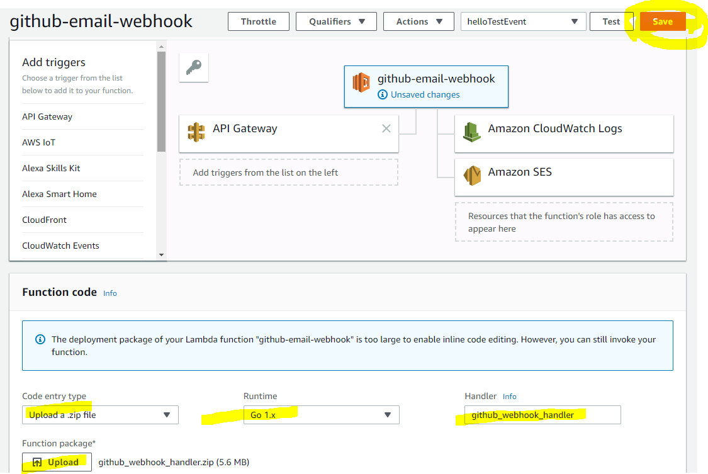
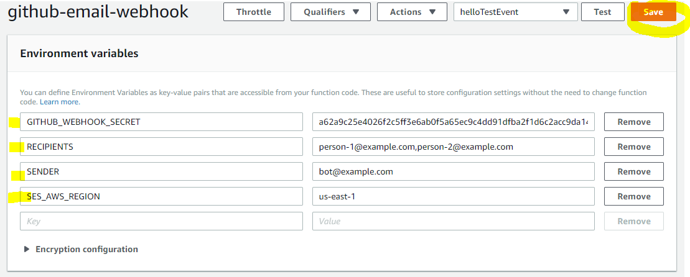
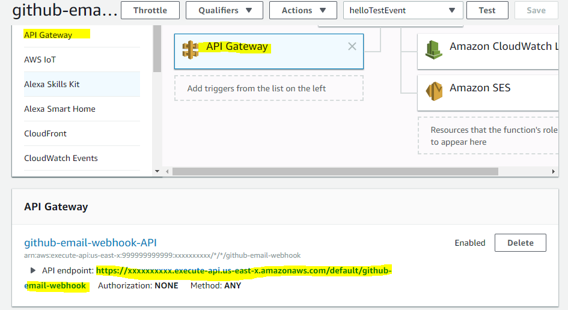
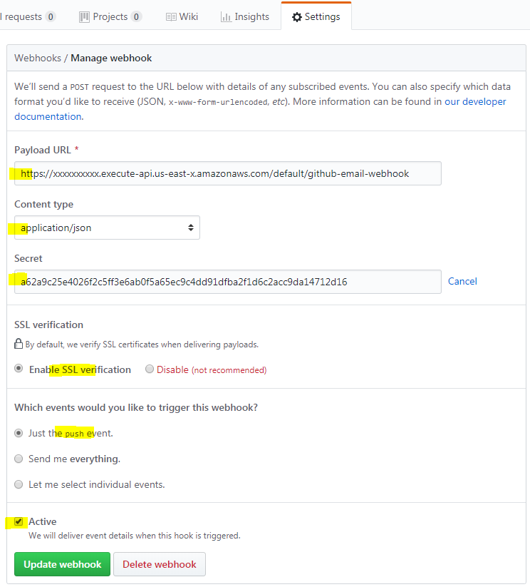

# aws-github-email-webhook
Webhook replacement for GitHub's deprecated email service. Runs on AWS.

## Deprecation of GitHub Services

https://developer.github.com/changes/2018-04-25-github-services-deprecation/

For those of us who used GitHub's baked-in email service to monitor pushes to
our repository, we have to look for a webhook solution. I didn't want to own
and maintain another server, so I searched for a "serverless" solution, but
didn't turn up anything. So this is a quick effort to try to duplicate what the
existing GitHub service was doing, and in a way that reduces some of the usual
sysadmin duties/worries. I figure there might be others in a similar situation,
so I'm sharing the code. Improve it as you see fit.

## Download the Binary

Here's the link to the `github_webhook_handler.zip` that you can just install
on AWS Lambda.

     https://github.com/bseib/aws-github-email-webhook/releases

But of course you shouldn't necessarily trust me, in which case you can build
your own binary:

## Building the Binary

Set your `GOPATH` environment variable to the `aws-github-email-webhook` directory:

    export GOPATH=/path/to/aws-github-email-webhook

To build `handler` binary:

    cd $GOPATH
    go get -u github.com/aws/aws-lambda-go
    go get -u github.com/aws/aws-sdk-go
    GOOS=linux GOARCH=amd64 go build -o github_webhook_handler handler

If on windows, build a zip file with proper executable file permissions.

    build-lambda-zip -o github_webhook_handler.zip github_webhook_handler

To build `build-lambda-zip` executable, see:
https://github.com/aws/aws-lambda-go/blob/master/README.md#for-developers-on-windows

## Setup

### Install the Binary on AWS Lambda

Once you have created a new AWS Lambda function, just upload the go binary manually:

### Setup Environment Variables

| env var                 | description |
|-------------------------|-------------|
| `GITHUB_WEBHOOK_SECRET` | This is the shared secret that you will setup on github.com. It will be used for the SHA1 signature of the messages POSTed to the webhook. Something like `openssl rand -hex 32` should generate a secret with sufficient entropy. |
| `RECIPIENTS`            | A comma separated list of recipients (no spaces) that will get an email for the GitHub Push Event. Should be a short list. Go the AWS SES Management Console to "whitelist" your recipient's email addresses. |
| `SENDER`                | Set this to a legit email address that your emails will be "from". If the GitHub Push Event has a Pusher with a known email address (it shows up in the comma separated list of RECIPIENTS), then SENDER will be set to the person who is doing the push. If no match, then use the value set for SENDER. |
| `SES_AWS_REGION`        | To send email with AWS SES, you have to set an AWS region. Pick an appropriate one for you. Should be in the same region as your lambda function. |

### Create API Gateway Endpoint

### Setup Webhook on GitHub

## References

These two AWS docs show how using Go to send an email via SES, and how to write
a lambda function:

https://docs.aws.amazon.com/sdk-for-go/v1/developer-guide/ses-example-send-email.html
https://docs.aws.amazon.com/lambda/latest/dg/go-programming-model-handler-types.html

The following article was helpful in setting up the neccessary AWS services. I'm not
an AWS expert, so I'll leave it to you to set the proper permissions and policies
for your setup.

https://medium.com/@khlbrg/sending-emails-with-go-and-aws-lambda-35c4626446ed

Google's `go-github` project already did the work to define all the GitHub events
as data types / structs with the JSON marshaling annotations. So I lifted only the
parts needed to receive and unmarshal a GitHub Push Event. That amounted to what
you'll find in `few_event_types.go`, `stringify.go`, and `timestamp.go`.

https://github.com/google/go-github

